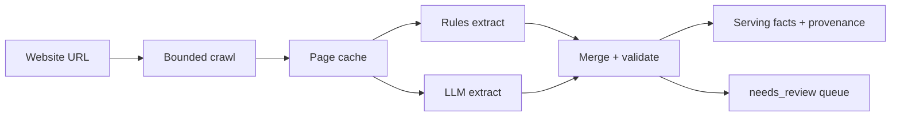

# Vendor information aggregation — strategy

**Status:** Phase 0 / 0b / 1 done. **Phase 2 batch done** for the original Chicago venue set. Enrichment merged onto main with Places photo work (`cursor/merge-enrichment-photos`). See [ai-native-data-plane.md](./ai-native-data-plane.md).

**Pinned / deferred:** Newer venue imports (hotels, museums, clubs — roughly `vendors.id` ≥ 478) are **not** in enrichment scope yet. Do not run `enrich-venues-batch` across that set until we deliberately reopen it. Pilot those after the spaces shape proves out on a handful of hotels/museums.

**Spaces shape (v2):** Multi-room venues keep **one vendor row**. Bookable rooms live in `venue_enrichment.facts.spaces[]` (+ `fee_schedule[]`) — no new RDS tables for v1.

**Scope today:** Original Chicago **venues** only. Same pattern can extend later to the expanded catalog, then caterers, florists, etc.

**Code:** `scripts/venue-enrichment/` · ops details in that folder’s [README](../scripts/venue-enrichment/README.md).

---

## Why we aggregate at all

**Google Places** gives discovery data: name, address, rating, photos, coarse `price_level`.

**Venue websites** give **decision** data couples actually use:

- Capacity / seating (as the venue states it)
- Policies (alcohol, curfew, insurance, deposits)
- Catering model (open vs preferred list vs in-house exclusive)
- Amenities + included inventory
- Preferred / partner vendor lists (network graph)
- FAQs, contact, social, package PDFs / floor plans

Dewy’s wedge vs a map listing is that wedding-specific layer — grounded in what venues publish, with provenance so couples (and we) can trust it.

```text
vendors.website → crawl → extract (rules + LLM) → normalize → store → UI / filters / agents
```

---

## Strategy (locked)

### Hybrid extraction (not rules-only, not LLM-only)

| Layer | Approach | Why |
|-------|----------|-----|
| Crawl | Bounded HTTP crawl (Cheerio); same origin; depth ≤ 3; page cap ~18; wedding-biased URL heuristics | Cheap, predictable; covers WordPress/Squarespace-style venue sites |
| Contact, social, network vendors, PDF links, FAQ structure | **Rules** | Deterministic, cheap, high precision when markup/lists are clear |
| Capacity, policies, amenities, about, pricing signals | **LLM** — one call per venue, structured schema + provenance | Semantic fields are messy across sites; heuristics alone under-deliver |
| Hard SPAs | Playwright **fallback only** | Batches 1–3 worked with plain `fetch`; don’t pay browser cost by default |
| Active learning / RL | **Not** the path | Overkill for ~85 venues; versioned re-extract beats online learning |

### LLM provider

- **Vertex AI** (GCP billing / credits), not AI Studio API keys (welcome credits exclude Gemini API).
- Primary model: `gemini-3.5-flash`; lite (`gemini-3.1-flash-lite`) used in pilot for cost/quality compare.
- Location: `global`.
- Every LLM field: `{ value, quote, source_url }`. Rules use `sources[]` with the same mental model.

### Schema mindset

- **Broad storage, conservative filters** — collect wide; only promote high-coverage, low-risk fields into browse filters later.
- Capacity: card scalar `capacity_max` (prefer largest **seated** figure) + `capacity_as_stated` + provenance-rich `capacity_configurations[]`. Serving UI uses rolled-up `spaces[]` (name, description, sq_ft, capacity breakdown, room fees).
- Pricing: short `price_display` + `pricing_model` + `pricing_as_stated`; day/season × room matrices go in `fee_schedule[]` / `spaces[].fees`.
- Catering enum: `open` | `preferred_list_required` | `exclusive_in_house` | `unknown`.
- Event insurance: `required` | `not_required` | `venue_covers` | `unknown`.
- Assets: **store URLs only** (no PDF binaries). Rules discover links; LLM `discovered_assets` can catch misses from an `ASSET CANDIDATES` link list in the prompt (cheap — no PDF bytes in the model).
- `needs_review` when capacity is null, crawl fails, or confidence is low.

### Production recipe (current)

1. Crawl venue site (HTTP first).
2. Rules: contact, social, vendors, FAQs, PDF discovery.
3. One Vertex Flash call for semantic fields with provenance required.
4. Flag `needs_review` for gaps / failures.
5. Persist + show (Phase 1+) — design in data-plane doc before coding.

---

## Pipeline algorithm (summary)

Per venue, given `website` (or `--url`):

```text
1. CRAWL
   Start at homepage (or given URL).
   BFS same-site pages: depth ≤ 3, pages ≤ ~30, delay between fetches.
   Prefer wedding/policy/vendor/FAQ/contact paths; skip corporate/blog noise when wedding-focused.
   Skip binary/upload URLs as pages; discover PDFs as assets from HTML.
   Cache HTML by content-hash (local now → object store later).
   Escalate to Playwright only if HTML is an empty SPA shell.

2. RULES EXTRACT (every crawled page)
   Contact (emails, phones, contact page URL)
   Social (IG/FB/TikTok/… + handles)
   About quote (best paragraph by page type rank)
   Network vendors (preferred/partner lists + PDF vendor lists)
   FAQs (FAQ pages; Q/A pairing including <strong>Q?</strong> patterns)
   Assets (PDFs, floor-plan images, maps embeds)
   Keyword amenity/policy flags + capacity candidates (wedding-biased pick)
   Merge with page-priority (wedding pages beat neutral)

3. LLM EXTRACT (one call / venue)
   Input: cleaned text from crawled pages, each block tagged --- PAGE: <url> ---
   Output: structured schema with { value, quote, source_url } on every field
   Model: Vertex gemini-3.5-flash (production); lite only for cost experiments
   Null if not stated — no guessing

4. MERGE / VALIDATE
   Serving record = rules structural fields + LLM semantic fields
   On conflict for capacity: prefer grounded LLM over rules regex when quote present
   Set needs_review if capacity null, crawl failed, or confidence low
   Stamp crawled_at, extracted_at, schema_version, model_id

5. PERSIST (Phase 1+)
   Write extraction_run(s) + update current venue_enrichment serving row
   See ai-native-data-plane.md for source vs derived vs serving
```



---

## Field catalog — what we pull and how

**Owner:** which extractor is authoritative for the *serving* value in the hybrid recipe. Rules may still compute a baseline for comparison / fallback.

| Field / column | Owner | Pull logic | Notes |
|----------------|-------|------------|-------|
| `about` | **LLM** | 1–3 sentence wedding-relevant description from page text | Rules also pick a long quote; LLM is cleaner for UI |
| `capacity_max` | **LLM** | Primary wedding guest number as stated (prefer seated reception when both exist) | Keep broad; don’t force filters yet |
| `capacity_min` | **LLM** | Min guests if stated | Often null |
| `capacity_as_stated` | **LLM** | Verbatim capacity wording | Downstream normalize later |
| `capacity_configurations[]` | **LLM** | Rows: space, setting (indoor/outdoor), style (seated/standing/…), guests + provenance | Empty if single number; feeds spaces rollup |
| `spaces[]` | **LLM + rollup** | One object per bookable room: description, sq_ft, capacity breakdown, amenities, fees, source_url | Serving/UI shape; merged from configs + LLM in `persist` (`schema_version` 2) |
| `fee_schedule[]` | **LLM** | Room × day × season venue fees (amounts + includes) | Attached to matching `spaces[].fees` when `space` matches; leftovers stay venue-level |
| `price_display` | **LLM** | Short card string (“Fri $6k / Sat $7k”) | Null if inquire-only |
| `pricing_model` | **LLM** | `flat` \| `per_head` \| `package` \| `inquire_only` \| `mixed` \| `unknown` | `mixed` for peak/off-peak |
| `pricing_as_stated` | **LLM** | Richer verbatim pricing nuances | |
| `discovered_assets[]` | **LLM** | Wedding-relevant PDF/asset **URLs** from ASSET CANDIDATES (cap 15) | Union with rules `assets[]` by URL; **do not store PDF files** |
| `amenities[]` | **LLM** | Thorough list of space features (parking, suites, outdoor, AV, …) | Rules boolean flags kept as secondary signal |
| `included_inventory[]` | **LLM** | Countable rental inclusions (tables, chairs, bars, drape, …) | Rules also scrape “includes” list headings |
| `policies.catering` | **LLM** | `open` \| `preferred_list_required` \| `exclusive_in_house` \| `unknown` | Prefer over rules allow/prohibit booleans |
| `policies.byo_alcohol` | **LLM** | Boolean or null | Null ≠ false |
| `policies.alcohol_provided` | **LLM** | Boolean or null | |
| `policies.event_insurance` | **LLM** | `required` \| `not_required` \| `venue_covers` \| `unknown` | Watch wording edge cases |
| `policies.curfew` | **LLM** | Music/event end time text | |
| `contact.emails` / `phones` | **Rules** | `mailto:` / `tel:` + text regex; merge across pages | High precision |
| `contact.contact_page_url` | **Rules** | First/best contact path | |
| `social.*` | **Rules** | Platform URL patterns; IG handle parse | |
| `network_vendors[]` | **Rules** | Preferred/partner list pages + PDF vendor lists | Categories via Dewy taxonomy guess |
| `faqs[]` | **Rules** | FAQ page parsers + Q/A pairing | `question`, `answer`, `source_url` |
| `assets[]` | **Rules** | PDF links, floor-plan imgs, maps iframes | **URLs + type only** — never host PDF bytes |
| `pages_crawled[]` | **Crawl** | URL list + context class | Provenance / debug |
| `confidence` / `notes` | **LLM** | Self-rated + caveats | Feed `needs_review` |
| `needs_review` | **Validate** | Null capacity, crawl fail, low confidence, hard conflicts | Ops queue |
| `crawled_at` / `extracted_at` | **Pipeline** | Timestamps | Run history |
| `schema_version` / `model_id` | **Pipeline** | Version stamps | Re-extract safely |

### Rules-only amenity / policy flags (secondary)

Still extracted for audit and fallback; **not** the primary serving shape once LLM lands:

- Amenities: `bridal_suite`, `grooms_suite`, `wheelchair_accessible`, `wifi`, indoor/outdoor ceremony & reception, `on_site_catering`, `coordination_included`, `tent_included`, `parking`, `av_included`, `piano`, …
- Policies: `outside_catering_allowed` / `_prohibited`, `byo_alcohol`, `alcohol_provided`, `event_insurance_required`, deposit/security/music end heuristics, …

### Conflict rules (serving)

| Conflict | Prefer |
|----------|--------|
| Rules capacity vs LLM capacity (both grounded) | **LLM** |
| Rules catering allow+prohibit both true | Higher page-priority wins; else LLM enum |
| LLM null, rules has value | Keep rules as soft fallback; still may `needs_review` |
| Crawl thin / wrong domain | Fix URL; re-crawl; don’t trust LLM on empty/wrong site |

---

### Capacity, pricing, and assets (shape decisions)

**Capacity** — store four layers:

1. `capacity_max` — one seated-preferring number for cards/filters  
2. `capacity_as_stated` — verbatim blob (always keep)  
3. `capacity_configurations[]` — provenance-rich rows (space × style)  
4. `spaces[]` — serving shape: rollup of configs + LLM room metadata (description, sq_ft, fee attachments)  

Filters stay simple; venue modal prefers `spaces[]` when present, else falls back to config rows.

**Pricing** — short `price_display` + `pricing_model` + `pricing_as_stated`, plus structured `fee_schedule[]` for published room × day × season amounts (Marchetti Fri/Sat/Sun × Pavilion/Pergola/Entire).

**Assets / PDFs** — **URL only.** PDFs are heavy, often copyrighted packages, and link-rot is acceptable to re-fetch when needed. Split two jobs:

| Job | Owner | What |
|-----|--------|------|
| Full preferred-vendor inventory (photographers, florists, …) | **Rules** `network_vendors[]` | Chez-scale lists (100+) — never dump into the LLM prompt |
| Missed downloads + vendor *hub* URLs | **LLM** `discovered_assets[]` | PDFs, floor plans, package docs, `/wedding-vendors/photography/` hubs (cap ~15 hubs, ~40 total candidates) |

Pipeline:

1. Rules collect `assets[]` + full `network_vendors[]` from category pages  
2. Cleaner lists capped `ASSET CANDIDATES` for the LLM (PDFs first; skip individual `/wedding-vendor/slug/` profiles)  
3. LLM returns `discovered_assets[]` (cap 15)  
4. Serving merge for downloads = union by URL; vendor graph stays rules-owned  

Do **not** put full PDF text into the default LLM call (cost). Optional later: escalate package-PDF text only when capacity/pricing are still null.

---

## Build path

| Step | What | Outcome |
|------|------|---------|
| Seed | Google Places → `vendors` in RDS | Discovery inventory |
| Phase 0 | CLI crawl + rules → stdout JSON | Prove extraction without DB coupling |
| Phase 0b | 10-venue Vertex pilot vs rules | Validate hybrid + provenance + cost |
| Phase 1 | Persist + API + venue modal | Serving layer (`venue_enrichment` + Lambda detail + modal) |
| Phase 2 | Batch ~85, `needs_review`, re-run | Coverage + ops |
| Phase 3 | Browse filters / compare | Product leverage of enrichment |

**Not yet:** object-store HTML archive as source of truth (local cache mirrors future key layout; promote when batch/re-extract needs it). See data-plane doc for the intended split.

---

## Phases

| Phase | What | DB | LLM |
|-------|------|----|-----|
| **0 — Spike** | Crawl + extract → stdout JSON | No | Optional |
| **0b — LLM pilot** | Rules vs Gemini on 10 venues | No | Yes (one call/venue × models) |
| **1 — Persist** | Migration, upsert, detail API, venue modal | Yes | Yes (hybrid recipe) |
| **2 — Batch** | All Chicago venues, review queue, re-run | Yes | Yes; focus spend on failures / gaps |
| **3 — Product** | Filters/compare on capacity, policies, etc. | Yes | Optional for edge cases |

Phase numbers are **delivery milestones**, not “Cheerio phase vs LLM phase.” Cheerio remains the crawl/parse substrate; LLM is the semantic extractor in the hybrid recipe.

---

## Why we chose this path

1. **Places alone isn’t enough** for wedding decisions; websites are the real source for capacity, policies, and preferred vendors.
2. **Rules win on structure** (emails, IG handles, vendor list links, PDF hrefs, FAQ pairs) — no reason to burn tokens there.
3. **LLM wins on meaning** (is insurance required? what’s the catering model? what’s capacity *as stated*?) — regex fights every new layout.
4. **One LLM call per venue** keeps cost tiny at Chicago scale (~$0.03–0.05/venue ballpark in pilot) while forcing a single grounded schema.
5. **Provenance from day one** so UI and future AI can cite the site, not invent.
6. **HTTP before Playwright** matches what we saw on real Chicago venues; escalate only when the HTML shell is empty.
7. **No RL / no forever HTML mirror as v1** — versioned extractions + optional TTL cache are enough; see [ai-native-data-plane.md](./ai-native-data-plane.md) and legal notes there.

---

## Pilot snapshot (Phase 0b)

- 10 Chicago venues, Vertex, rules + Flash + Flash-Lite.
- Rough cost ~$0.31 for the LLM portion of the pilot.
- Strong overall; known watch items: thin crawls (e.g. Rockwell), capacity nulls (Chez), enum edge cases (Joinery insurance wording), rules vs LLM capacity conflicts (prefer LLM when grounded), wrong domains (Colvin → use `colvinhouseevents.com`).

Do not treat pilot JSON as production source of truth until Phase 1 persist lands.

---

## Explicit non-goals (for now)

- Scraping behind logins / bypassing blocks
- Hosting venue HTML/PDFs for users to download from Dewy
- Normalizing every capacity flavor into rigid seated/standing filters
- Enriching non-venue categories at the same depth
- Building embeddings / agent tools before the data plane schema exists
